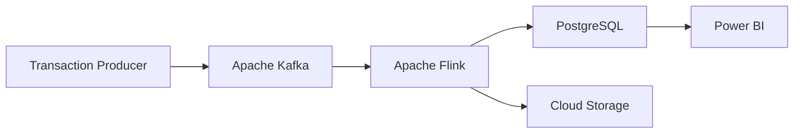

# Real-Time Retail Analytics Platform

A cloud-based platform for processing and analyzing real-time retail transaction data.

## Project Overview

This project builds a real-time data system for a retail chain. The system collects sales transactions continuously, processes streaming data, stores the results, and provides data for analysis and reporting.

Apache Kafka is used to receive transaction streams, Apache Flink processes and aggregates the data, and PostgreSQL stores the processed results.

### Vietnamese Project Title

**Xây dựng Hệ thống Dữ liệu Trực tuyến cho Cửa hàng Bán lẻ với Kafka, Flink và PostgreSQL**

### English Project Title

**Building a Real-Time Retail Data System with Kafka, Flink, and PostgreSQL**

## Main Objectives

- Generate and collect retail transaction data continuously.
- Process transaction streams in real time.
- Calculate total revenue and product sales.
- Analyze revenue by product and store.
- Store processed results in PostgreSQL.
- Support data analysis and reporting.
- Deploy and evaluate the system in a cloud environment.

## System Architecture

## Technologies

- Python
- Apache Kafka
- Apache Flink
- PostgreSQL
- Microsoft Azure
- Power BI

## Course Information

- **Course:** Cloud Computing
- **Course Code:** IS402
- **University:** University of Information Technology – VNU-HCM
- **Instructor:** ThS. Hà Lê Hoài Trung
- **Email:** [trunghlh@uit.edu.vn](mailto:trunghlh@uit.edu.vn)

## Team Members

| No. | Full Name | Student ID | Email |
|---:|---|---:|---|
| 1 | Nguyễn Trần Thảo Nguyên | 23521052 | [23521052@gm.uit.edu.vn](mailto:23521052@gm.uit.edu.vn) |
| 2 | Nguyễn Thuý Ngân | 23520996 | [23520996@gm.uit.edu.vn](mailto:23520996@gm.uit.edu.vn) |
| 3 | Lê Đào Anh Thư | 23521537 | [23521537@gm.uit.edu.vn](mailto:23521537@gm.uit.edu.vn) |
